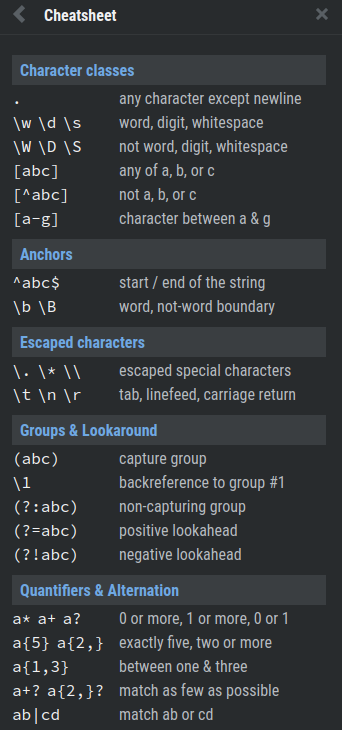

# 1. Introduction
Created Saturday 13 June 2020

* Regular Expressions are called Regex.
* They are very useful in text-formatting/parsing.
* It is not a programming language, but a concept in computer science.
* They are less sophisticated than a Context Free Grammar, but more powerful than a DFA.
* Regex notation is universal all languages and systems. This is initentional. e.g Regex that works in Perl, will also work in JS, Python.

Instructions:
**Unless stated otherwise, the following is assumed:**

1. Everything is a character.
2. An action occurs only once.
3. Everything is defined for matching.

**Cheatsheet**

