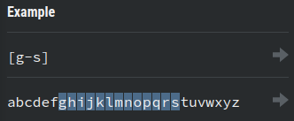

# 2. Character Classes
Created Saturday 13 June 2020

These are general terms for data.

1. Set
	1. Character set ⇒ [ABC] ⇒ Any character in the set. There's no preference w.r.t position. Same as OR operator.

2. Negated set ⇒ [^ABC] ⇒ Any characters not in the set. Same as NOR.

2. Range ⇒ Defined only for numbers and letters(both upper and lowercase). Range order same as ASCII code. **0-9A-Za-z. **Range can be used inside character sets.

3. Dot ⇒ . ⇒ Any character except linebreaks(CR and/or LF)

*****

Character classes with a meaningful opposite:

4. Letters
	1. Word ⇒ \w ⇒ Any alphanumeric character and underscore. Equivalent to [0-9A-Za-z_]. Only ASCII characters. **Called a word, misnomer.**

2. Non-Word ⇒ \W ⇒ Any non-alphanumeric character and non-underscore.

5. Numbers
	1. Digit ⇒ \d ⇒ Same as [0-9]

2. Non-digit ⇒ \D ⇒ Same as [^0-9], any non-digit character.

6. Whitespaces
	1. Whitespace ⇒ \s ⇒ Any whitespace character(space, tab, line break)
	2. Non-whitespace ⇒ \S ⇒ Anything that's not a whitespace.

