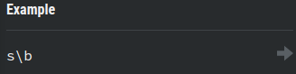
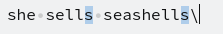
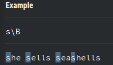

# 3. Anchors
Created Saturday 13 June 2020

1. Beginning ⇒ ^ ⇒ Beginning of string character.
2. End ⇒ $ ⇒ end of string character.
3. Boundaries
	1. Boundaries with ⇒ **c**\b ⇒ "All **c**s which are last letters". Word seperators are non-letters(_ is a letter)

2. Not boundary ⇒ **c**\B ⇒"All **c**s which are not last letters".

