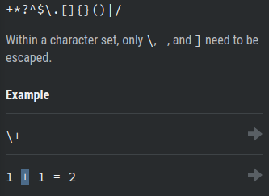
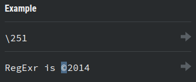
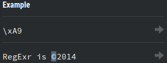

# 4. Escape Characters
Created Saturday 13 June 2020

1. Reserved characters - Used for syntax. 15 of them in total. **Quotes **are not reserved.

2. Octal Escape ⇒ \ABC ⇒ Matches the ASCII character for octal number abc, for smaller numers use \0AB or \00A

3. Hexadecimal Escape ⇒ \xAB ⇒ matches the ASCII character ab. x is compulsory.

4. Unicode escape ⇒ \uABCD ⇒ Matches the unicode characer abcd. u is compulsory
5. Common string escape characters - \n, \t, \0, \r, \f, \v. For the bell character use \7 not \a.

*****

List of escape chars

1. Special Characters
2. Period .
3. Plus +
4. Asterisk *
5. Question mark ?
6. Caret  ^
7. Dollar $
8. Opening parentheses ( 
9. Closing parentheses )
10. Opening bracket [
11. Closing bracket ]
12. Opening brace {
13. Closing brace }
14. Pipe symbol |
15. Back slash \

* Note- backslash is required if the regex uses any of the special symbols

