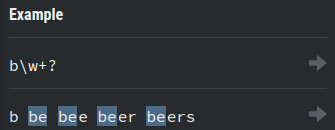

# 5. Quantifiers
Created Saturday 13 June 2020

1. Star(*) ⇒ zero or more
2. Plus(+) ⇒ one or more
3. Optional(?) ⇒ zero or one
4. Frequency range:
	1. {a} ⇒ exact number
	2. {a, b} ⇒ **inclusive range**
	3. {a, } ⇒ more than or equal. Less than or equal is represented as {0, b}
5. lazy ⇒ ? ⇒ This is a quantifier, modifier. 
	1. +? will return trimmed matches of the least length. By default, quantifiers are greedy - i.e they return the maximum match.
	2. {2,5}? will select return the least matches of length 2 to 5.

Because be is the smallest, all matches are made as be.

7. Alteration ⇒ | ⇒ Acts as a boolean OR, and gets shortciruited if match is found. 

Note: AND is implicit everywhere - so it has no symbol.

