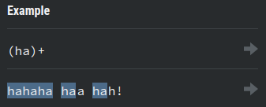
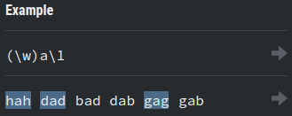

# 6. Capture and References
Created Saturday 13 June 2020

1. Capturing group ⇒ (reg_expression) ⇒ Returns an individual match as well as the normal match. Can be thought of as a function that has a print statements in the recursive anchor(group catch) and returns the string too(basic regexp behavior).

* Syntax doesn't change for a group.

2. Numeric reference ⇒ \index_of_group ⇒ If the same groups are needed at different places, we can use named reference. Follow **1 based indexing**. Similar to #define

3. Non-capturing group ⇒ (?:reg_exp) ⇒ Groups multiple tokens without creating a capture group. Used just for cleaner code. **Very important.**

* ☐ Learn about named capturing groups

